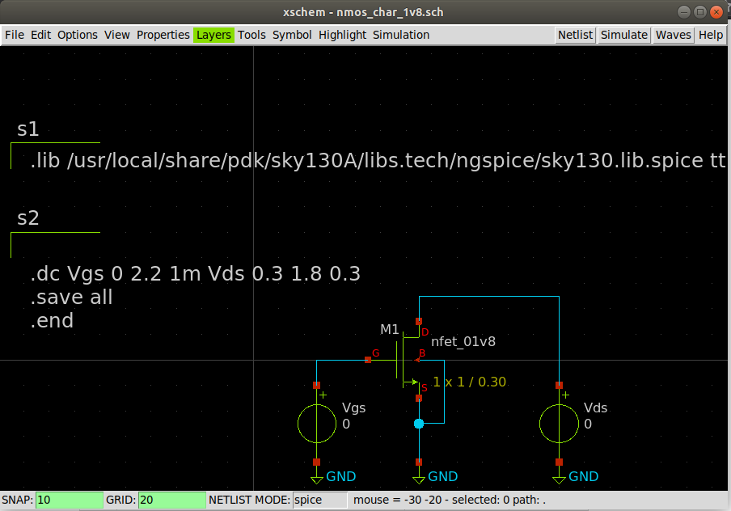
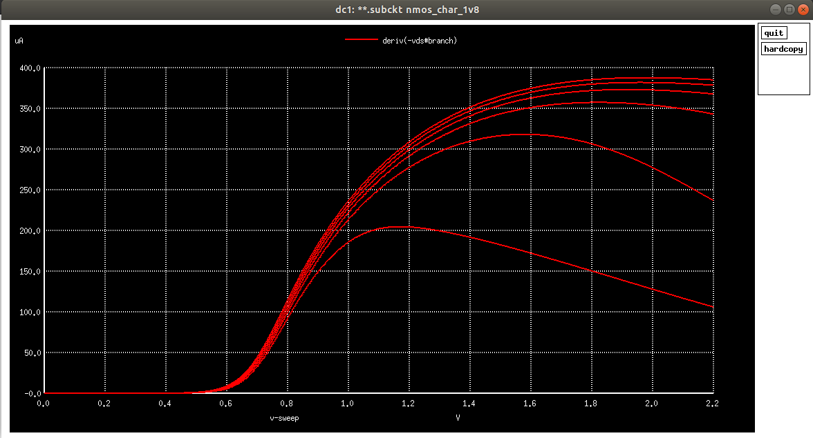
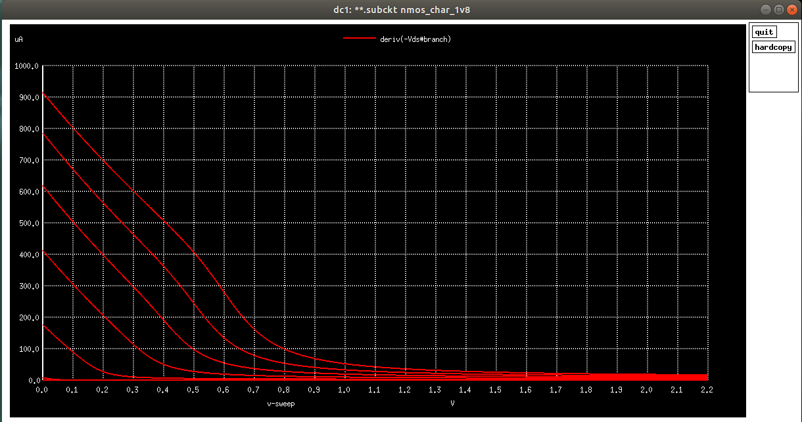
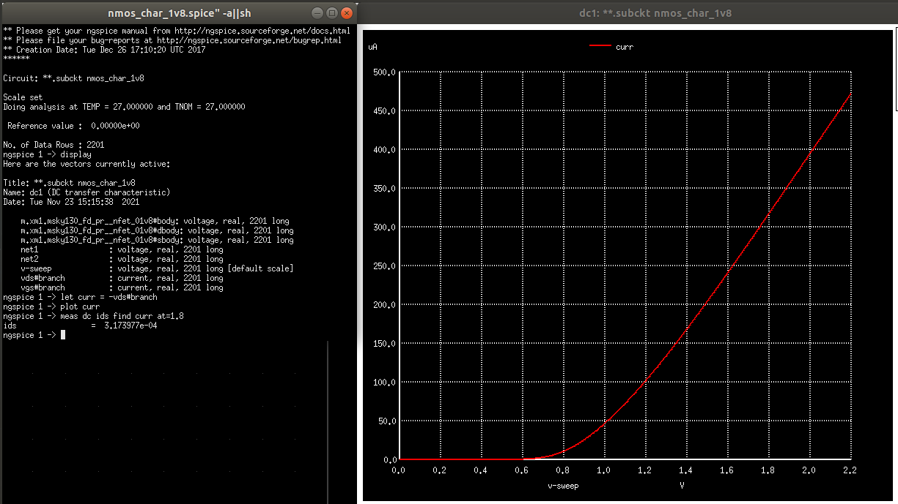
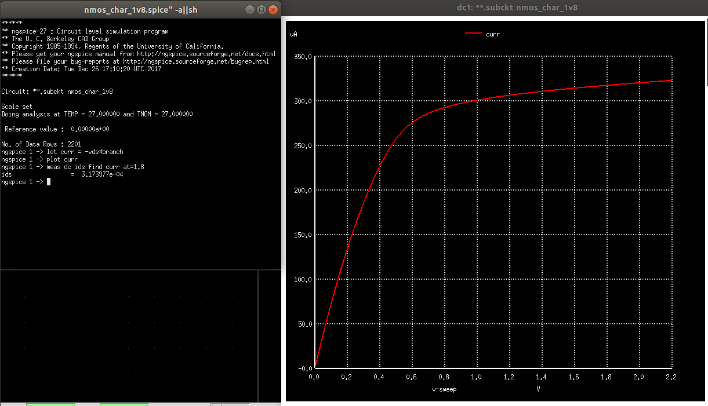
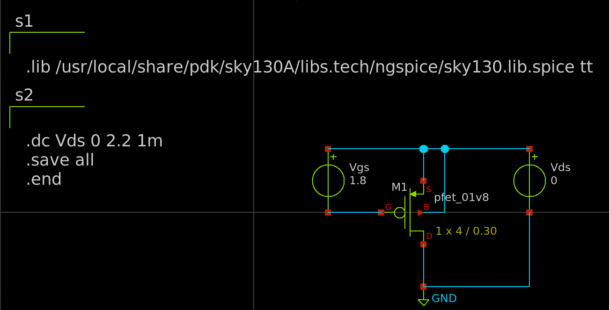
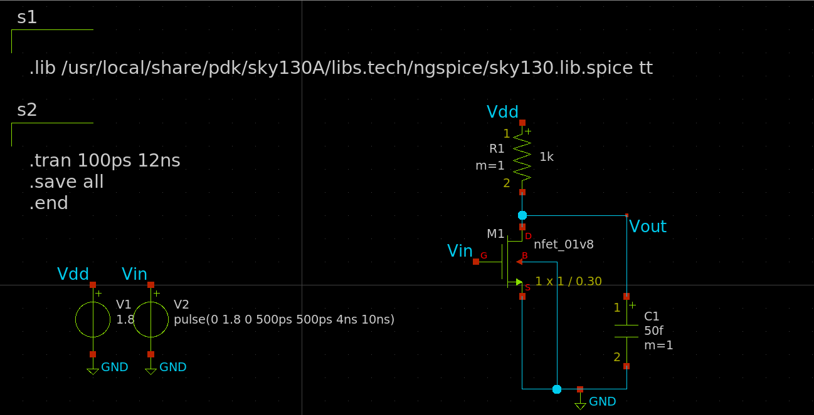

# Inverter-design-and-analysis-using-sky130pdk
### Design and Analysis of CMOS Inverter using the sky130 pdk and various open source tools
---
This project has only one motive; that is to experiment with working of an inverter and understanding all the parameters involved with it. The design will utilise the models that are present under the __skywater 130nm pdk__ and various open source tools such as, __Xschem__, __NGSPICE__, __MAGIC__, __Netgen__, etc.

The whole process starts with analysis of _NMOS_ and _PMOS_ devices, specifically the 1.8v standard models available inside the pdk to determine a common working W/L ratio and also the gm, ron and similar values. After this we start with the design of a CMOS inverter that includes schematic, measurement of various parameters like delays, noise margin, risetime, falltime, etc. This part would also act as a case study on __SPICE__ where we use it's programming capabilities to better our abilities in measurements of aforementioned parameters. Then we will engage in the design a layout for our inverter in __magic layout editor__. Here, we will also explore the different layers available to the user and how we utilise them in a design and what it translates to in terms of a mask. Lastly, we compare the two netlists, that is the schematic and the layout one, which is popularly referred to as ___LVS___. If everything is hunky-dory, this project would then conclude. 

I will try to keep updating it as often as possible, as this first project is a primary resource for me to practice analog design, with the open source toolchain and definitely to keep a documentation that is easily understandable by anyone who later tries to practice it the same way.

Let's get right into it. 


---

## Contents
- [1. Tool and PDK Setup](#1-Tools-and-PDK-setup)
  - [1.1 Tools Setup](#1.1-Tools-setup)
  - [1.2 PDK Setup](#1.2-PDK-setup)
- [2. Analysis of MOSFET models](#2-Analysis-of-MOSFET-models)
  - [2.1 General MOS analysis](#2.1-General-MOS-analysis)
  - [2.2 Weak 0 and Strong 1](#2.2-Weak-0-and-Strong-1)
  - 

###### Section 1 has been copies from [VSDOPEN21_BGR Readme file](https://github.com/D-curs-D/vsdopen2021_bgr/edit/main/README.md) Thanks [Kunal](https://github.com/kunalg123)!

## 1. Tools and PDK setup

### 1.1 Tools setup
For the design and simulation of the BGR circuit we will need the following tools.
- Spice netlist simulation - [Ngspice]
- Layout Design and DRC - [Magic]
- LVS - [Netgen]
- Schematic Capture - Xschem

#### 1.1.1 Ngspice 


[Ngspice](http://ngspice.sourceforge.net/devel.html) is the open source spice simulator for electric and electronic circuits. Ngspice is an open project, there is no closed group of developers.

[Ngspice Reference Manual](http://ngspice.sourceforge.net/docs/ngspice-manual.pdf): Complete reference manual in HTML format.

**Steps to install Ngspice** - 
Open the terminal and type the following to install Ngspice
```
$  sudo apt-get install ngspice
```
#### 1.1.2 Magic


 [Magic](http://opencircuitdesign.com/magic/) is a VLSI layout tool.
 
**Steps to install Magic** - 
 Open the terminal and type the following to install Magic
```
$  wget http://opencircuitdesign.com/magic/archive/magic-8.3.32.tgz
$  tar xvfz magic-8.3.32.tgz
$  cd magic-8.3.28
$  ./configure
$  sudo make
$  sudo make install
```
#### 1.1.3 Netgen


[Netgen](http://opencircuitdesign.com/netgen/) is a tool for comparing netlists, a process known as LVS, which stands for "Layout vs. Schematic". This is an important step in the integrated circuit design flow, ensuring that the geometry that has been laid out matches the expected circuit.

**Steps to install Netgen** - Open the terminal and type the following to insatll Netgen.
```
$  git clone git://opencircuitdesign.com/netgen
$  cd netgen
$  ./configure
$  sudo make
$  sudo make install 
```
#### 1.1.4 Xschem

[Xschem](http://repo.hu/projects/xschem/xschem_man/xschem_man.html) is a schematic capture program that allows to interactively enter an electronic circuit using a graphical and easy to use interface. When the schematic has been created a circuit netlist can be generated for simulation.

**Steps to install Xschem**
Follow the instructions given [here](http://repo.hu/projects/xschem/xschem_man/tutorial_install_xschem.html) or follow [this](https://www.youtube.com/watch?v=jXmmxO8WG8s) video tutorial by the creator himself

### 1.2 PDK setup

A process design kit (PDK) is a set of files used within the semiconductor industry to model a fabrication process for the design tools used to design an integrated circuit. The PDK is created by the foundry defining a certain technology variation for their processes. It is then passed to their customers to use in the design process.

The PDK we are going to use for this BGR is Google Skywater-130 (130 nm) PDK.


**Steps to download PDK** - Open the terminal and type the following to download sky130 PDK.
```
$  git clone https://github.com/RTimothyEdwards/open_pdks.git
$  cd open_pdks
$  ./configure [options]
$  make
$  [sudo] make install
```

*or you can also use the instructions given at [open_pdk installation](http://opencircuitdesign.com/open_pdks/index.html), and also for all the other applications used here can be found at [Open Circuit Design](opencircuitdesign.com/) website. The website covers details about a lot of opensource tools, with details about their usage installation etc.*

---

## 2. Analysis of MOSFET models

#### 2.1 General NMOS Analysis

In this section I start with our analysis of MOSFET models present in sky130 pdk. I would be using the 1.8v transistor models, but you can definitely use and experiment with other ones present there. below is the schematic I created in **Xschem**.

___highly recommended to check out the tutorials of xschem [here](http://repo.hu/projects/xschem/xschem_man/xschem_man.html) and ngspice [here](http://ngspice.sourceforge.net/docs/ngspice-manual.pdf)___



The components used are:<br>
```nfet_01v8.sym``` - from xschem_sky130 library<br>
```vsource.sym``` - from xschem devices library<br>
```code_shown.sym``` - from xschem devices library<br>

I used the above to plot the basic characteristic plots for an NMOS Transistor, That is ___Ids vs Vds___ and ___Ids vs Vgs___. To do that, just save the above circuit with the above mentioned specifications and component placement. After this just hit __Netlist__ then __Simulate__. ___ngspice___ would pop up and start doing the simulation based calculations. It will take time as all the libraries need to be called and attached to the simulation spice engine. Once that is done, you need to write a couple commands in the ngspice terminal:<br><br>
```display``` - This would display all the vectors available for plotting and printing.<br>
```setplot``` - This would list all the set of plots available for this simulation.<br>
_after this choose a plot by typing '''setplot <plot_name>'''. for example '''setplot tran1'''_<br>
```plot``` - to choose the vector to plot.<br>
_example : plot -vds#branch_<br><br>

Then you must see the plot below you, if you did a DC sweep on the __VGS__ source for different values of __VDS__:<br>
<br><br>

This definitely shows us that the threshold value is between __600mV to 700mV__ and I think I will be using ___650mV___ for my future calculations.
Similarly, when I sweep __VDS__ source for different values of __VGS__, I get the below plot:<br>

<br><br>

Now the above two definitely looks like what the characteristics curves should, but now we need to choose a particular curve that we would do further analysis on.

I also did plot gm and go(or ro) values for the above mosfet. This would be crucial as we can obtain a lot of parameters from these values. Both of these below are for the general dc sweep we did above. 
<br>
<br>

Since I am making an inverter, let's choose the highest value avialable for the Vds, that is __1.8V__. So to do that, we just change the value of Vds source to 1.8 and then hit netlist, then simulate to simulate the circuit.<br>


This above plot also tells us the value of current at this value of __Vgs__ which is around __320uA__. Next step is to calculate the __Gm__, that is the transconductance parameter. To do that we simple type the commands as shown in the console in the left hand side. The ```deriv()``` function takes the derivative with respect to the independent variable present at the current simulation. From the definition of __Gm__ we are aware that it is ___dIds/dVds___. Hence, I did the same to plot the __Gm__ of this nfet. After this I measured the value at 1.8V.<br>
___Information on how to use the meas command can be found at [ngspice manual](http://ngspice.sourceforge.net/docs/ngspice-manual.pdf) !___ <br><br>


Similaraly I did the same for ___Ids vs Vds___ and also used that to find ___rds___

<br><br>

Hence, we now have all our important values we needed. Same can be done for a ___PMOS___. Motive is same, but expecially to extract the value of Aspect ratio for which the current is the same in both NMOS and PMOS. I have done some experimentation and found that at __W/L of PMOS__ = __4 * (Aspect ratio of NMOS)__, the current value is pretty close. So, we found the NMOS had a current of __317 microamps__ while PMOS has the current of __322 microamps__ (both at |Vgs| = 1.8V). SO like 5 microamps apart. (NOT BAD!!) <br><br>
<br>
<br><br>
___The last one might be the most important one for an Inverter design___<br><br>


#### 2.2 Weak 0 and Strong 1
What does the above mean? Look at the graph below,

